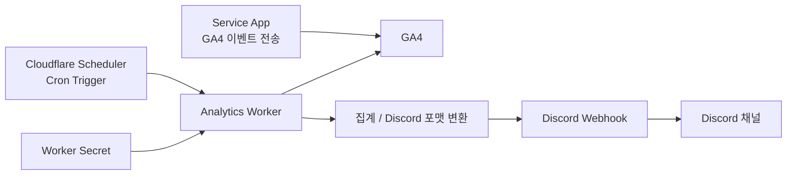

2개의 서비스를 운영하면서 GA4를 통해 이벤트를 수집하고 있다. GA4 대시보드를 북마크해두고 들여다보기는 하지만, 매번 들어가서 확인하는 게 은근 일이다. 그래서 매일 오전 9시에 일일 리포트를 만들어 디스코드 채널로 보내주는 스케줄러를 붙였다.

Cloudflare Scheduler가 매일 9시에 Worker를 실행하고, 이 Worker는 GA4 Data API를 조회한 뒤 Discord 웹훅으로 리포트 메시지를 전송한다. 이 글에서는 내가 이 흐름을 어떻게 구성했는지 구현 위주로 정리해보려고 한다.

## 전체 구조



1. 앱은 제품 이벤트를 GA4로 보낸다.
2. Cloudflare Scheduler는 매일 UTC `00:00`에 Worker를 실행한다. 한국 시간으로는 오전 9시다.
3. Worker는 GA4 접근 정보와 Discord 웹훅 URL 같은 시크릿을 읽는다.
4. Worker는 GA4 Data API를 호출해 필요한 지표를 집계하고 Discord용 payload로 정리한다.
5. 집계한 결과를 Discord 웹훅으로 전송한다.

## 1. Worker 구성

운영 중인 서비스의 Worker와는 별도로, 리포트 전송만 담당하는 Worker를 만들었다.

```bash
yarn create cloudflare analytics-worker
cd analytics-worker
```

## 2. GCP와 GA4 권한

GA4 데이터를 조회하려면 GCP와 GA4 세팅이 필요하다.

1. GCP 프로젝트 생성
2. Google Analytics Data API 활성화
3. 서비스 계정 생성과 JSON 키 발급
4. GA4 Property에 서비스 계정 권한 부여

최종적으로 Worker가 필요로 하는 값은 아래와 같다.

- GA4 `propertyId`
- 서비스 계정 `clientEmail`
- 서비스 계정 `privateKey`
- Discord 웹훅 URL
- 보고서 기준 timezone

## 3. Secret 설정

이런 작업은 보통 아래 값들을 Worker secret으로 등록해둔다.

- `GA4_PROPERTY_ID`
- `GA4_CLIENT_EMAIL`
- `GA4_PRIVATE_KEY`
- `DISCORD_WEBHOOK_URL`
- `REPORT_TIMEZONE`

이 저장소 기준으로 secret은 `wrangler secret put`으로 넣는다.

```bash
npx wrangler secret put GA4_PROPERTY_ID
npx wrangler secret put GA4_CLIENT_EMAIL
npx wrangler secret put GA4_PRIVATE_KEY
npx wrangler secret put DISCORD_WEBHOOK_URL
npx wrangler secret put REPORT_TIMEZONE
```

## 4. 어떤 숫자를 볼까?

코드를 쓰기 전에 먼저 정해야 하는 건 매일 어떤 숫자를 볼지다. 이 기준이 흐리면 Worker가 돌아가도 리포트는 별 의미가 없다.

예를 들어 이런 이벤트를 직접 조회할 수 있다.

- `sign_up_completed`
- `core_action_completed`
- `secondary_action_completed`
- `notification_clicked`
- `followup_action_completed`
- `report_viewed`

기본적으로는 아래와 같은 지표들을 볼 수 있다.

- 활성 사용자 수
- 새 사용자 수
- 평균 참여 시간
- 이벤트 수

이 정도만으로도 트래픽이 줄었는지, 신규 유입이 붙고 있는지, 참여 시간이 유지되는지, 이벤트 볼륨이 갑자기 꺾였는지를 빠르게 파악할 수 있다.

## 5. Cron Trigger 연결

일일 리포트의 핵심은 한 번 실행되는 코드가 아니라, 매일 같은 시간에 자동으로 도는 작업이다. 그래서 Worker 본문보다 먼저 Cron Trigger부터 붙였다.

Cloudflare Workers에서는 `scheduled()` 핸들러로 cron 기반 작업을 붙일 수 있다.

```ts
export default {
  async fetch() {
    return new Response("Analytics Scheduler Worker is running.", {
      status: 200,
    });
  },

  async scheduled(
    _event: ScheduledController,
    env: Env,
    ctx: ExecutionContext,
  ) {
    ctx.waitUntil(runDailyReport(env));
  },
};
```

설정 파일에는 cron을 등록한다.

```jsonc
// wrangler.jsonc
{
  "name": "analytics-worker",
  "main": "src/index.ts",
  "triggers": {
    "crons": ["0 0 * * *"],
  },
}
```

여기서 하나 주의할 점은 시간대다. cron 자체는 UTC 기준으로 해석되기 때문에, 리포트 기준 날짜를 어떤 시간대로 계산할지도 같이 정해두는 편이 안전하다. 나는 `REPORT_TIMEZONE`을 `Asia/Seoul`로 두고 한국 시간 기준으로 날짜를 계산했다.

한국 시간 기준으로 "어제 리포트"를 보내고 싶다면 아래 세 가지를 같은 timezone 기준으로 맞춰야 한다.

- Scheduler 실행 시각
- 리포트 날짜 계산 기준
- Discord 메시지에 표시할 날짜

`wrangler.jsonc`에 `0 0 * * *`를 넣어두고, 코드에서는 `REPORT_TIMEZONE` 기준으로 "어제"를 계산하면 한국 시간 기준으로 매일 오전 9시에 전날 리포트가 발행된다.

## 6. GA4 조회

Trigger를 붙인 뒤에는 Worker 안에서 GA4 Data API를 호출하면 된다. 현재 구현에서는 Web Crypto API로 서비스 계정 JWT를 직접 서명해서 access token을 받는다.

구현할 때 중요하게 본 건 두 가지였다.

- 전날 기준으로 어떤 기간 데이터를 볼지 명확히 계산할 것
- 필요한 이벤트만 필터링해서 가져올 것

흐름은 대략 이렇다.

1. `REPORT_TIMEZONE` 기준으로 "어제" 날짜를 계산한다.
2. 서비스 계정으로 JWT access token을 발급받는다.
3. 필요한 `runReport` 요청들을 보낸다.
4. 응답에서 `activeUsers` 같은 값을 읽어 DTO로 묶는다.
5. 이 DTO를 Discord embed payload로 변환한다.

실제 호출 코드는 `propertyId:runReport` 엔드포인트에 직접 POST하는 형태다.

```ts
async function runReport(
  env: Env,
  request: Ga4RunReportRequest,
): Promise<Ga4RunReportResponse> {
  const token = await fetchAccessToken({
    clientEmail: env.GA4_CLIENT_EMAIL,
    privateKey: env.GA4_PRIVATE_KEY,
  });
  const url = `${GA4_DATA_API}/${env.GA4_PROPERTY_ID}:runReport`;

  const res = await fetch(url, {
    method: "POST",
    headers: {
      Authorization: `Bearer ${token}`,
      "Content-Type": "application/json",
    },
    body: JSON.stringify(request),
  });

  if (!res.ok) {
    const body = await res.text();
    throw new Error(`GA4 runReport failed (${res.status}): ${body}`);
  }

  return res.json() as Promise<Ga4RunReportResponse>;
}
```

## 7. Discord 전송

Discord로 보낼 때는 `embeds`를 사용해 핵심 지표만 먼저 보이도록 구성했다.

```ts
const payload = {
  embeds: [
    {
      title: `📊 GA4 일일 리포트 — ${reportDate}`,
      color: 0x2ecc71,
      fields: [
        {
          name: "👥 활성 사용자",
          value: `**${num(summary.activeUsers)}**명`,
          inline: true,
        },
        {
          name: "🆕 새 사용자 수",
          value: `**${num(summary.newUsers)}**명`,
          inline: true,
        },
        {
          name: "\u200b",
          value: "\u200b",
          inline: true,
        },
        {
          name: "⏱ 평균 참여 시간",
          value: `**${formatDuration(summary.averageEngagementSecondsPerActiveUser)}**`,
          inline: true,
        },
        {
          name: "🎯 이벤트 수",
          value: `**${num(summary.eventCount)}**건`,
          inline: true,
        },
        {
          name: "\u200b",
          value: "\u200b",
          inline: true,
        },
      ],
      footer: { text: "analytics-worker" },
      timestamp: new Date().toISOString(),
    },
  ],
};
```

payload를 만들고 나면 Discord 웹훅 URL에 JSON으로 POST하면 된다.

```ts
async function sendDiscordWebhook(webhookUrl: string, payload: unknown) {
  const response = await fetch(webhookUrl, {
    method: "POST",
    headers: {
      "Content-Type": "application/json",
    },
    body: JSON.stringify(payload),
  });

  if (!response.ok) {
    const text = await response.text();
    throw new Error(`DISCORD_WEBHOOK_FAILED: ${response.status} ${text}`);
  }
}
```

## 마무리

실제로는 매일 이런 형태의 리포트가 디스코드 채널로 들어오게 했다.


운영할 때 매일 확인해야하는 지표들인데 훨씬 편해질 것 같다!
