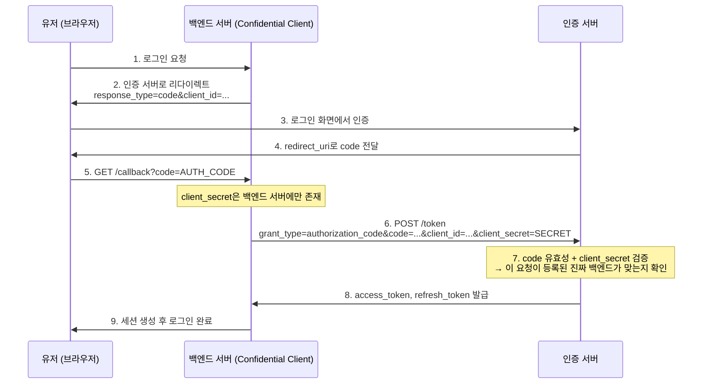
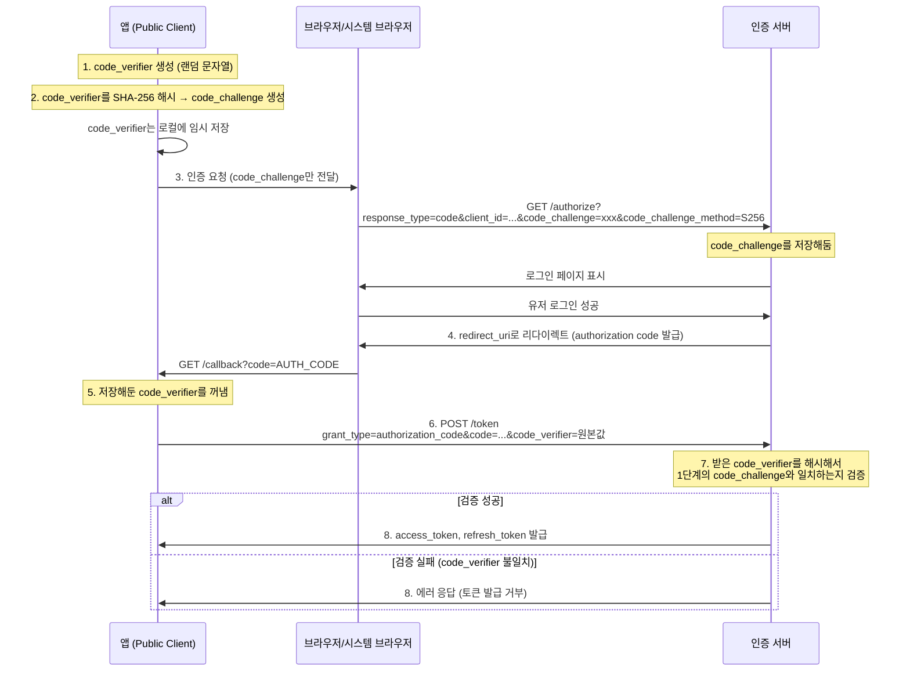
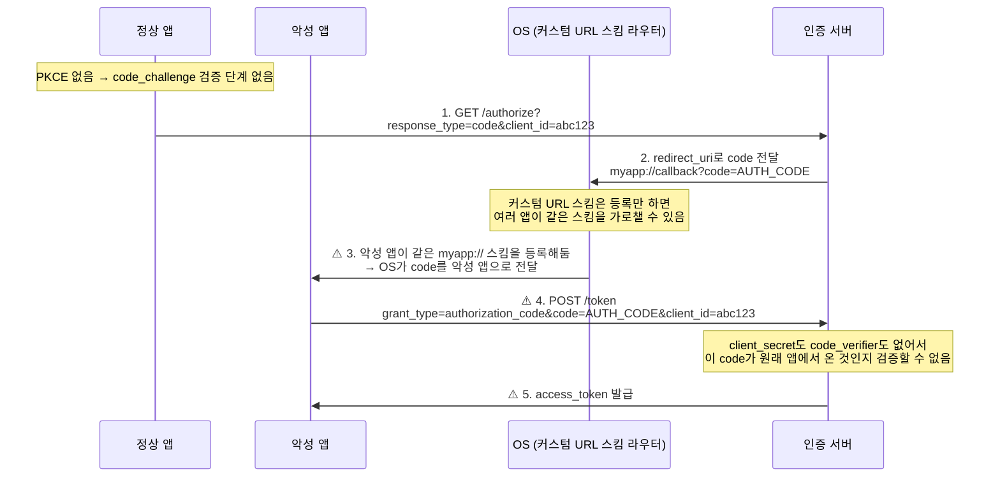

## OAuth가 없던 시절

유저의 구글 캘린더에서 빈 시간대를 찾아 미팅 시간을 자동으로 조율해주는 서비스를 만들고 싶다고 해보자.

OAuth가 없었던 시절에는 이런 기능을 구현하려면 사용자의 구글 계정 아이디와 비밀번호를 내 서비스(서드파티 앱)에 직접 입력받아야 했다. 목적은 "구글 캘린더에서 일정이 없는 빈 시간대를 찾는 것"인데, 그러려면 계정 전체에 접근할 수 있는 비밀번호를 통째로 넘겨받아야 했다.

이렇게 했을 때 여러 문제가 발생하는데,

1. 비밀번호 원본을 서드파티가 넘겨받아 보관/사용해야 함
2. 빈 시간대만 읽으면 되는데도 서드파티 앱이 메일, 드라이브 등 해당 계정의 모든 접근 권한을 가짐
3. 유저가 특정 서드파티만 골라서 접근을 끊기 어려움 → 비밀번호를 변경하면 모든 앱의 접근이 한꺼번에 끊김
4. 서드파티 중 하나라도 뚫리면 그 비밀번호로 구글 계정 전체가 뚫림

OAuth는 이 문제를 해결하려고 출발했다. 핵심은 인증과 인가를 쪼개서, 계정 비밀번호가 아니라 필요한 권한만 서드파티 앱에 주는 데 있다.

## OAuth 1.0 ([RFC 5849](https://datatracker.ietf.org/doc/html/rfc5849), 2010)

OAuth 1.0은 트위터, 구글 등이 모여 만든 커뮤니티 스펙에서 출발했다.

OAuth 1.0의 가장 큰 문제는 구현 난이도였다.

모든 요청마다 `HMAC-SHA1` 같은 방식으로 파라미터를 직접 서명해야 했다. 요청 하나를 보내려면 모든 파라미터를 정렬하고, percent-encoding 규칙에 맞춰 인코딩한 뒤, 이어붙인 문자열을 다시 해시해야 했다. 이 중 어느 한 단계라도 클라이언트와 서버의 구현이 어긋나면 서명이 깨져 디버깅 난이도가 매우 높았다고 한다.

## OAuth 2.0 ([RFC 6749](https://translate.autocrypt.io/rfc6749), 2012)

**서명을 제거하고 보안을 TLS에 위임해서 단순화**했다.

HTTPS(TLS)가 통신 구간 암호화를 책임진다는 전제 하에, OAuth 2.0은 `Bearer Token`을 사용한다. Bearer Token은 토큰을 소지한 주체를 곧 권한 보유자로 간주하는 방식이다. 매번 서명을 계산하던 1.0에 비해 구현이 훨씬 쉬워졌지만, 토큰이 탈취되면 공격자도 동일한 권한을 행사할 수 있다.

### Client Type

Client Type은 client_secret을 안전하게 보관할 수 있는 환경인지에 따라 클라이언트를 구분한다.

| 타입             | 설명                                             | 예시                                    |
| ---------------- | ------------------------------------------------ | --------------------------------------- |
| **confidential** | client_secret을 안전하게 지킬 수 있는 클라이언트 | 서버 사이드 웹앱의 백엔드               |
| **public**       | client_secret을 지킬 수 없는 클라이언트          | 네이티브 앱, 브라우저에서 직접 도는 SPA |

### Grant Type

Grant Type은 클라이언트가 어떤 상황과 방식으로 access token을 발급받을지를 정한 절차다.

| Grant Type                              | 설명                                                                                                                                                                                                                                                                                                                                                                              | 비고 |
| --------------------------------------- | --------------------------------------------------------------------------------------------------------------------------------------------------------------------------------------------------------------------------------------------------------------------------------------------------------------------------------------------------------------------------------- | ---- |
| **Authorization Code**                  | 서버 사이드 웹앱용. code를 먼저 받고, 백엔드가 그 code를 client_secret과 함께 실제 토큰으로 교환한다.                                                                                                                                                                                                                                                                             | -    |
| **Implicit**                            | 브라우저에서 직접 토큰을 받는 방식(SPA용, secret 없이). `response_type=token`으로 요청하면 code 교환 단계 없이 access_token이 바로 redirect URL의 fragment(`#`)에 실려 돌아온다. 이 fragment가 브라우저 주소창과 history에 남을 수 있고, 페이지 안에서 실행되는 어떤 스크립트든(서드파티 스크립트, XSS로 주입된 코드 포함) `location.hash`를 읽으면 토큰을 그대로 탈취할 수 있다. | 폐기 |
| **Resource Owner Password Credentials** | 유저의 아이디/비밀번호를 앱이 직접 입력받아 그대로 토큰 서버에 전달하는 방식. 사실상 OAuth가 애초에 없애려던 "비밀번호를 서드파티에 준다"는 패턴을 grant type 하나로 다시 만든 셈이다. 1st-party 앱처럼 신뢰 관계가 이미 확실한 특수한 경우에만 쓰라고 했지만, 실무에서 남용되었다.                                                                                               | 폐기 |
| **Client Credentials**                  | 유저 개입 없이 앱과 앱이 통신하는 경우(M2M).                                                                                                                                                                                                                                                                                                                                      | -    |

Implicit과 Password Credentials은 "secret 없는 클라이언트를 어떻게 다룰 것인가"에 대한 초기 해법이었으나 현재는 둘 다 폐기되었다. Implicit은 토큰을 URL에 그대로 노출시켰고, Password Credentials는 애초에 풀려던 문제인 비밀번호 공유를 그대로 재현했기 때문이다.

confidential client 백엔드가 있는 웹앱은 이런 흐름으로 인증한다.

## PKCE ([RFC 7636](https://datatracker.ietf.org/doc/html/rfc7636), 2015)

OAuth 1.0의 서명 방식이 왜 필요했는지 다시 생각해보면, 결국 "이 요청이 진짜 나(client)한테서 온 게 맞다"는 걸 증명하기 위해서였다. 2.0은 이 증명 자체를 없애고 TLS에 맡겼다. 그렇다면 client_secret도 없는 public client는 어떻게 증명할까?

이때 쓰는 것이 PKCE다. OAuth 1.0처럼 매번 서명하는 대신, Authorization Code 발급 과정마다 일회용 증명을 하나 만들어 검증한다. 목표는 client_secret 없이도, Implicit처럼 토큰을 URL에 노출시키지 않고 public client가 authorization code를 안전하게 access token으로 교환하도록 하는 것이다.

### PKCE가 없다면?

커스텀 URL 스킴(`myapp://`)은 중복 등록을 허용하기 때문에 여러 앱이 같은 스킴을 등록하면 유저에게 선택창이 뜨거나, 조건에 따라 먼저 설치된 앱이 가로챌 수 있다. 이때 client_secret도 code_verifier도 없으면 인증 서버 입장에서는 "이 code를 갖고 온 게 정말 원래 요청을 시작한 앱이 맞는지" 확인할 방법이 없다.

## AppAuth 패턴 ([RFC 8252](https://datatracker.ietf.org/doc/html/rfc8252), 2017)

PKCE는 code가 중간에 탈취되더라도 공격자가 그걸로 토큰을 발급받는 것을 막지만, 이전 단계에 구멍이 있었다. 애초에 로그인 화면을 누가 띄우느냐의 문제다.

과거엔 네이티브 앱이 흔히 웹뷰를 임베드해서 OAuth 인증을 처리했다. 문제는 임베드된 웹뷰(embedded user-agent)가 앱과 같은 프로세스/메모리 공간에서 돌아가기 때문에, 호스트 앱이 웹뷰 내부 상태에 개입할 수 있는 API를 갖고 있다는 점이다.

- JavaScript injection으로 로그인 폼에 입력된 값을 직접 읽어올 수 있음
- 키 입력 이벤트를 후킹해서 로깅할 수 있음
- 웹뷰의 쿠키 저장소를 앱이 직접 읽을 수 있어, 로그인 성공 후 세션 쿠키를 탈취해 재사용할 수 있음.

로그인 화면 자체를 앱이 통제하면 앱이 유저의 자격증명과 쿠키를 그대로 복사해갈 수 있다. 반면 시스템 브라우저나 in-app browser tab(iOS SFSafariViewController, Android Custom Tabs)은 OS 레벨에서 별도 프로세스로 격리되어 있어 호스트 앱이 이런 API에 접근할 수 없다.

그래서 RFC 8252는 네이티브 앱이 반드시 이런 **외부 유저 에이전트**를 사용하고, 앱과 보안 도메인을 공유하는 embedded user-agent는 금지하도록 했다. 여기에 PKCE를 적용한 Authorization Code Grant를 강제하는 이 조합을 **AppAuth 패턴**이라고 부른다.

## OAuth 2.1 (Draft)

PKCE와 AppAuth 패턴은 서로 다른 시점에, 서로 다른 문제를 해결하기 위해 등장했다. OAuth 2.1은 OAuth 2.0 이후 여러 RFC와 보안 권고에 흩어져 있던 개선 사항을 하나의 최신 표준으로 통합하려는 규격이다. 기존에 여러 RFC와 Best Current Practice에서 권고되던 내용을 기본 규칙으로 통합한다.

- Authorization Code Grant에서는 public/confidential client 모두 PKCE 필수 사용
- 쿼리스트링에 access token을 담지 않음
- redirect_uri는 사전 등록값과 완전히 일치해야 함
- Implicit, Resource Owner Password Credentials grant 삭제
